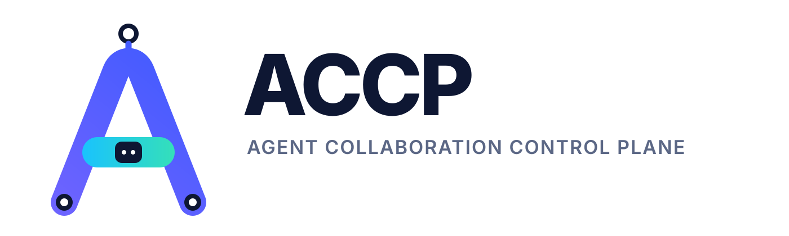
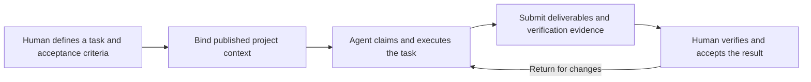

# ACCP

[简体中文](README.md) | [English](README.en.md)



[](https://go.dev/)
[](https://react.dev/)
[](https://www.typescriptlang.org/)
[](https://vite.dev/)
[](https://www.heroui.com/)
[](https://tailwindcss.com/)
[](https://www.postgresql.org/)
[](https://nats.io/)
[](LICENSE)

**Bring teams and AI coding agents together around the same task, with deliverables people can verify and trace.**

ACCP (Agent Collaboration Control Plane) is an AI collaboration platform for software teams. Teams use the browser to manage tasks, share project context, review deliverables, and approve tool operations. Agents connect through a Bridge to claim tasks, read context, and submit results. A human owner makes the final acceptance decision for every task.

[Quick start](#quick-start) · [Technology stack](#technology-stack) · [Console guide (Chinese)](docs/web-console-guide.md) · [Private deployment (Chinese)](docs/production-deployment.md) · [Connect an agent (Chinese)](docs/m2-execution.md#使用-local-bridge-和-go-sdk) · [Contributing](#contributing) · [Open source acknowledgments](#open-source-acknowledgments)

## Why use ACCP?

When a team uses several AI coding agents, requirements can get scattered across conversations, execution context can drift, and someone still needs to check whether the output meets the delivery criteria. ACCP organizes this work into a shared workflow:

- **Know who owns the work:** Each task has a human owner, an executing agent, dependencies, and acceptance criteria.
- **Use defined project context:** Requirements, interfaces, and policies are published in versions; each execution is bound to a fixed context snapshot.
- **Deliver verifiable results:** Submit code references, documents, or reports; verify their provenance and content; then let the owner accept or return them.
- **Trace authorization and operations:** Limit agent project permissions and session lifetimes, and require independent human approval for high-risk operations through the gateway.

ACCP is designed for software teams that want to keep their existing AI clients, manage task delivery in one place, and deploy the collaboration platform within their organization.

## What can you do with it?

| Capability | How it works |
| --- | --- |
| Tasks and work queue | Create tasks with owners and acceptance criteria; filter by status, owner, or keyword; see tasks awaiting acceptance, execution failures, and pending approvals on the dashboard |
| Project context | Publish versions of requirements, interfaces, and policies so agents read the snapshot for their execution and can reference results from prerequisite tasks |
| Agent collaboration | Connect execution clients through the generic Bridge, MCP, or Go SDK to claim tasks, report progress, submit results, and coordinate work through dependencies |
| Deliverable acceptance | Inspect content, Git references, and provenance; verify GitHub commits and PRs; check each acceptance criterion; accept or return the deliverable |
| Tool approvals | Configure permissions and policies for governed tools; require an independent reviewer for high-risk operations; inspect outcomes and audit records |
| Team administration | Create and archive projects, register members and repositories, assign project roles, deactivate members, and revoke their agent sessions |
| Operations | Inspect system health, event failures, and uncertain tool outcomes; export redacted diagnostics; use maintenance, backup, and recovery tools |

The web console supports Simplified Chinese, English, and Russian, along with shareable task links and a mobile layout.

## How a task moves through ACCP



For example, to deliver an order-query API, the team first publishes the interface contract, creates implementation and test tasks, and sets their dependencies. An agent reads the relevant snapshot and submits code or a test report. The owner checks the verified results against the acceptance criteria. If a high-risk tool operation is needed through the gateway, a separate reviewer approves it. Tasks, executions, context versions, deliverables, and review records remain linked as delivery evidence.

For detailed steps, see the [web console guide (Chinese)](docs/web-console-guide.md) and the [order-query API collaboration example (Chinese)](docs/collaboration-flow.md).

## Technology stack

| Layer | Technology | Role in ACCP |
| --- | --- | --- |
| Backend | Go, standard-library `net/http` | API, task collaboration logic, tool gateway, Worker, and operations commands |
| Web console | React, TypeScript, Vite | Console UI, type checking, development and production builds |
| UI and styling | HeroUI, Tailwind CSS | Interactive components, themes, and responsive layout |
| Data and events | PostgreSQL, pgx, NATS JetStream | Business data persistence, database access, and durable event delivery |
| Identity and security | OpenID Connect, go-oidc, oidc-client-ts, go-jose, age | Enterprise sign-in, token validation, and backup encryption |
| Agent integration and contracts | MCP Go SDK, JSON Schema, OpenAPI | Agent and tool integration, data structures, and API contract validation |
| Deployment and development tools | Docker Compose, Node.js, npm | Single-machine private deployment, web builds, and project validation scripts |
| Quality assurance | Go testing, Playwright, axe-core, Redocly CLI, Ajv, markdownlint | Backend tests, browser acceptance tests, accessibility checks, and contract and documentation validation |

Badge versions reflect the current repository configuration. See [go.mod](go.mod), the [web package.json](web/package.json), the [root package.json](package.json), [Dockerfile](Dockerfile), and [compose.yaml](compose.yaml) for dependencies and build versions.

## Quick start

These steps create a trial environment on your machine for the first time. You need Git, Docker, Docker Compose v2, and Node.js 22.22.3. Docker builds both the web console and backend.

```sh
git clone https://github.com/JavaWeh/ACCP.git
cd ACCP
node scripts/dev-env.mjs
docker compose --env-file .accp-local/compose.env up --build -d
docker compose --env-file .accp-local/compose.env --profile tools run --rm bootstrap
```

After startup:

1. Open the [local development sign-in page](http://127.0.0.1:8080/dev-login). Read the generated credentials from `.accp-local/dev-users.json` on your machine. Alice is the demo project administrator; Bob is a member and reviewer.
2. In the demo project, create and publish requirements or policies under Project Context, then create a task with acceptance criteria under Task Collaboration.
3. Follow the [agent integration guide (Chinese)](docs/m2-execution.md#使用-local-bridge-和-go-sdk) to register a client, create a limited session, and connect the Bridge.

You can also generate an example task awaiting human acceptance from the repository root:

```sh
node scripts/m2-smoke.mjs
```

This command uses the protocol to produce a sample deliverable; it does not launch a real AI client. When it finishes, sign in as Bob and review the result under Task Collaboration → Deliverables and Acceptance.

Local data is stored in Docker named volumes, and randomly generated credentials are written only to an ignored local directory. For an existing environment, follow the [upgrade instructions (Chinese)](docs/m3-m4-platform.md#运行与升级), keeping the original project name and data volumes; do not run bootstrap again.

## Private deployment and integration

ACCP provides a single-organization, single-machine Linux Docker Compose deployment using enterprise OIDC sign-in. The deployment includes the web console, Go API, Worker, PostgreSQL, and NATS. An administrator must configure HTTPS, the identity provider, members, and repositories.

- [Deployment and ongoing administration (Chinese)](docs/production-deployment.md): installation, identity integration, separation of runtime accounts, and installation checks.
- [Operations, backup, and recovery (Chinese)](docs/operations.md): maintenance windows, key rotation, encrypted backups, isolated recovery, and incident handling.
- [Agent Bridge and SDK (Chinese)](docs/m2-execution.md#使用-local-bridge-和-go-sdk): client connection, task execution, and session configuration.
- [Tool gateway configuration (Chinese)](docs/m3-m4-platform.md#工具配置与-mcp-gateway): connect GitHub or your own MCP tools, configure approvals, and reconcile outcomes.

Approval and full audit coverage apply to operations authorized through the ACCP gateway. Direct access to external systems using a client's own credentials falls outside that coverage.

## Current scope

The code provides a complete collaboration flow for tasks, context, execution, deliverables, approvals, and auditing, plus team administration and operations tools. It is available for controlled trials. Claude Desktop and Codex have passed a single-person, two-client example acceptance exercise; see the [acceptance record (Chinese)](docs/acceptance-2026-09-16.md) for the tested versions and limitations.

Formal release distribution, capacity validation at target scale, and full recovery acceptance remain outstanding. Content is currently centered on text and Git references, with a 256 KiB body limit. When assessing a deployment, consult the [delivery plan and validation boundaries (Chinese)](docs/product-delivery-plan.md) and [operations acceptance record (Chinese)](docs/acceptance-product-operations.md) to determine whether it fits your environment.

## Documentation and support

| I want to… | Start here |
| --- | --- |
| Use the console, handle tasks, and resolve common errors | [Web console and support guide (Chinese)](docs/web-console-guide.md) |
| Understand permissions, human responsibility, and approvals | [Governance design (Chinese)](docs/governance.md) |
| Learn about the architecture, data model, and collaboration protocol | [Architecture (Chinese)](docs/architecture.md) · [Data model (Chinese)](docs/data-model.md) · [Protocol contracts (Chinese)](contracts/README.md) |
| Check delivery progress and future plans | [Product delivery plan (Chinese)](docs/product-delivery-plan.md) |
| Report a problem, suggest a feature, or contribute code | [Contribution guide (Chinese)](CONTRIBUTING.md) · [GitHub Issues](https://github.com/JavaWeh/ACCP/issues) |

## Contributing

We welcome bug reports, feature ideas, documentation improvements, and code contributions.

- **Report a problem:** Use the [bug report template](https://github.com/JavaWeh/ACCP/issues/new?template=bug_report.yml) to include your environment, reproduction steps, and expected behavior.
- **Suggest a feature:** Use the [feature request template](https://github.com/JavaWeh/ACCP/issues/new?template=feature_request.yml) to explain your use case, the problem, and the improvement you would like.
- **Contribute documentation or code:** Check existing issues and PRs, read the [contribution guide (Chinese)](CONTRIBUTING.md), set up your development environment, run the relevant checks, and submit a PR.

A human owner confirms the scope and acceptance result of every contribution. You are welcome to use an AI agent to help. Redact logs, configuration, and screenshots before publishing them.

## Open source acknowledgments

ACCP is built on the work of the open source community. Thanks to the authors, maintainers, and contributors of these projects for the languages, frameworks, infrastructure, and development tools:

- **Languages and build tools:** [Go](https://go.dev/), [TypeScript](https://www.typescriptlang.org/), [Node.js](https://nodejs.org/), [npm](https://github.com/npm/cli), and [Vite](https://vite.dev/).
- **UI and interaction:** [React](https://react.dev/), [HeroUI](https://www.heroui.com/), and [Tailwind CSS](https://tailwindcss.com/).
- **Data and messaging:** [PostgreSQL](https://www.postgresql.org/), [pgx](https://github.com/jackc/pgx), [NATS Server](https://github.com/nats-io/nats-server), and [NATS Go Client](https://github.com/nats-io/nats.go).
- **Identity and encryption:** [go-oidc](https://github.com/coreos/go-oidc), [oidc-client-ts](https://github.com/authts/oidc-client-ts), [go-jose](https://github.com/go-jose/go-jose), and [age](https://github.com/FiloSottile/age).
- **Protocols and contracts:** [Model Context Protocol Go SDK](https://github.com/modelcontextprotocol/go-sdk), [jsonschema](https://github.com/santhosh-tekuri/jsonschema), [Ajv](https://github.com/ajv-validator/ajv), [ajv-formats](https://github.com/ajv-validator/ajv-formats), and [Redocly CLI](https://github.com/Redocly/redocly-cli).
- **Testing and documentation:** [Playwright](https://playwright.dev/), [axe-core](https://github.com/dequelabs/axe-core), [Prettier](https://prettier.io/), [markdownlint-cli2](https://github.com/DavidAnson/markdownlint-cli2), [markdown-it](https://github.com/markdown-it/markdown-it), [github-slugger](https://github.com/Flet/github-slugger), [yaml](https://github.com/eemeli/yaml), and [Shields.io](https://shields.io/).
- **Containers and deployment:** [Docker / Moby](https://github.com/moby/moby) and [Docker Compose](https://github.com/docker/compose).

We also thank the projects on which these depend. The complete dependency lists and locked versions are in [go.mod](go.mod), [go.sum](go.sum), the [root package-lock.json](package-lock.json), and the [web package-lock.json](web/package-lock.json). Third-party license and copyright notices are governed by their upstream repositories and distributed contents.

## License

ACCP is licensed under the [Apache License 2.0](LICENSE).
