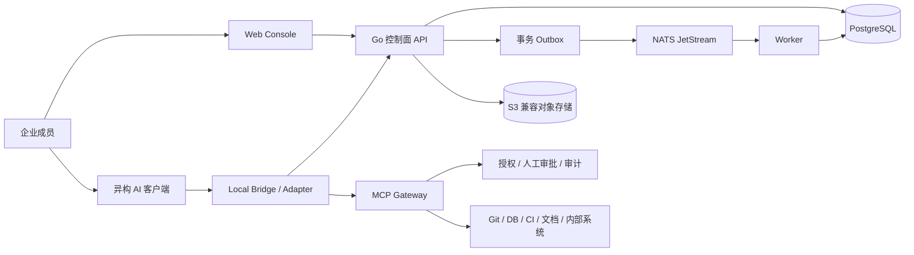

# ACCP — Agent Collaboration Control Plane

面向企业研发团队的多人、多 AI Coding Agent 协作控制平台。以人为责任主体，以 Agent 为执行代理，通过统一任务、上下文、事件与成果协议连接不同 AI 客户端。

> **当前阶段：M2 异构执行。** 已实现 M1 人类控制面，以及 Agent Session、依赖 DAG、TaskRun/快照、租约、证据登记、事件 Worker、Go SDK 和 MCP stdio Bridge。最终人工验收、Git 核验和 MCP Gateway 留在 M3，Web 界面留在 M4；下方架构展示完整目标。

## 核心原则

| 优先关系 | 平台约束 |
| --- | --- |
| Human > Agent | Task 必须有人类 Owner；Agent 只能作为 Executor |
| Task > Conversation | 任务、执行与验收是协作主线，对话只是辅助记录 |
| Context > Prompt | 每次执行绑定已授权、明确版本的 ContextSnapshot |
| Artifact > Chat Output | 可验证成果与证据是交付依据 |
| Event > Direct Agent Call | 跨 Agent 协作由控制面事件及依赖驱动 |
| Protocol > Vendor | 业务模型与客户端厂商、私有 SDK 解耦 |
| Source of Truth > Agent Memory | 每种资源明确权威来源，Agent 记忆仅供参考 |

## 目标架构



参考技术栈：**Go + TypeScript/React + PostgreSQL + NATS JetStream + S3 兼容存储 + OIDC + OpenTelemetry**。采用模块化单体、独立 Worker 与 Gateway，优先企业私有部署。

本地客户端保留现有使用方式；受治理的操作必须经过网关专用授权。客户端使用独立凭证绕行的操作不在 ACCP 强制审批与完整审计保证内。

## 文档导航

| 主题 | 入口 |
| --- | --- |
| M2 升级、Bridge、事件与一键验收 | [M2 异构执行](docs/m2-execution.md) |
| M1 身份配置、基础 API 与历史验收 | [M1 控制面](docs/m1-control-plane.md) |
| 总体架构、核心模块、Source of Truth | [架构设计](docs/architecture.md) |
| 核心数据模型与状态机 | [数据模型](docs/data-model.md) |
| API、事件、Adapter、幂等与兼容性 | [协作协议](docs/protocol.md) |
| 人类责任、权限、审批、MCP 边界 | [治理设计](docs/governance.md) |
| 一条完整协作流程 | [订单查询 API 示例](docs/collaboration-flow.md) |
| MVP、验收与后续演进 | [MVP 路线](docs/mvp.md) |
| 技术难点、失效场景、运维设计 | [可靠性与技术难点](docs/reliability.md) |
| 研发流程、提交与审查 | [开发工作流](docs/development-workflow.md) |
| 架构决策及代价 | [ADR 索引](docs/adr/README.md) |
| OpenAPI、Schema 和正反例 | [协议契约](contracts/README.md) |

## 启动与验收

需要 Docker、Docker Compose v2、Node.js 22：

```sh
node scripts/dev-env.mjs
docker compose --env-file .accp-local/compose.env up --build -d
docker compose --env-file .accp-local/compose.env --profile tools run --rm bootstrap
node scripts/m2-smoke.mjs
```

访问 `http://127.0.0.1:8080/readyz` 检查就绪状态。两个人类开发账号的随机凭证仅写入 `.accp-local/dev-users.json`。这些命令用于首次初始化；数据保存在命名卷中。已有 M1 数据时按 [M2 升级说明](docs/m2-execution.md#本地部署与从-m1-升级) 先停止旧 API、补充配置再迁移；不要重复 bootstrap 或删除数据卷。

## 校验文档与契约

需要 Node.js 22.22.3 和 npm 10（仅作为文档工具链，不是后端运行时）：

```sh
npm ci --ignore-scripts
npm run check
npm run check:history
```

校验覆盖 Markdown、内部链接和锚点、OpenAPI、Schema、正反例、验证器测试以及本地私有文件禁入规则。该结果不证明未来业务运行时已经实现鉴权、审批或状态转换。

## MVP 路线

1. **M1 已实现**：人类身份、项目角色、Task 提交/取消、Context 版本与发布。
2. **M2 已实现**：通用 SDK/Bridge、受限 Session、TaskRun/快照、依赖/租约、事件订阅与重放；尚无真实厂商客户端兼容性结论。
3. 成果来源、Git 核验、MCP 受控操作、人工审批与验收。
4. Web 操作界面、责任链查询、故障恢复及端到端验收。

详细状态见 [MVP 验收矩阵](docs/mvp.md)。首个 Git 成果核验集成计划使用 GitHub，核心模型仍保持厂商无关；真实客户端兼容性将在后续联合验收。

## 贡献与许可证

贡献前阅读 [CONTRIBUTING](CONTRIBUTING.md)。所有任务必须有人类负责人；高风险变更需要人工审核。内部 skills、个人 Agent 配置与凭证只保存在本地，不纳入公开仓库。

采用 [Apache License 2.0](LICENSE)，保留仓库已有许可证。
