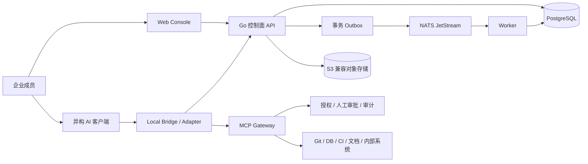

# ACCP — Agent Collaboration Control Plane

面向企业研发团队的多人、多 AI Coding Agent 协作控制平台。以人为责任主体，以 Agent 为执行代理，通过统一任务、上下文、事件与成果协议连接不同 AI 客户端。

> **当前阶段：架构设计与协议契约基线。** 本仓库提供设计文档、机器可读契约、示例和校验工具；尚无可运行的控制面、前端或客户端 Adapter。下文平台能力均为目标设计。

## 核心原则

| 优先关系 | 平台约束 |
| --- | --- |
| Human > Agent | Task 必须有人类 Owner；Agent 只能作为 Executor |
| Task > Conversation | 任务、执行与验收是协作主线，对话只是辅助记录 |
| Context > Prompt | 每次执行绑定已授权、明确版本的 ContextSnapshot |
| Artifact > Chat Output | 可验证成果与证据是交付依据 |
| Event > Direct Agent Call | 跨 Agent 协作由控制面事件及依赖驱动 |
| Protocol > Vendor | 业务模型与客户端厂商、私有 SDK 解耦 |
| Source of Truth > Agent Memory | 每种资源明确权威来源，Agent 记忆仅供参考 |

## 目标架构



参考技术栈：**Go + TypeScript/React + PostgreSQL + NATS JetStream + S3 兼容存储 + OIDC + OpenTelemetry**。采用模块化单体、独立 Worker 与 Gateway，优先企业私有部署。

本地客户端保留现有使用方式；受治理的操作必须经过网关专用授权。客户端使用独立凭证绕行的操作不在 ACCP 强制审批与完整审计保证内。

## 文档导航

| 主题 | 入口 |
| --- | --- |
| 总体架构、核心模块、Source of Truth | [架构设计](docs/architecture.md) |
| 核心数据模型与状态机 | [数据模型](docs/data-model.md) |
| API、事件、Adapter、幂等与兼容性 | [协作协议](docs/protocol.md) |
| 人类责任、权限、审批、MCP 边界 | [治理设计](docs/governance.md) |
| 一条完整协作流程 | [订单查询 API 示例](docs/collaboration-flow.md) |
| MVP、验收与后续演进 | [MVP 路线](docs/mvp.md) |
| 技术难点、失效场景、运维设计 | [可靠性与技术难点](docs/reliability.md) |
| 研发流程、提交与审查 | [开发工作流](docs/development-workflow.md) |
| 架构决策及代价 | [ADR 索引](docs/adr/README.md) |
| OpenAPI、Schema 和正反例 | [协议契约](contracts/README.md) |

## 校验文档与契约

需要 Node.js 22.22.3 和 npm 10（仅作为文档工具链，不是后端运行时）：

```sh
npm ci --ignore-scripts
npm run check
npm run check:history
```

校验覆盖 Markdown、内部链接和锚点、OpenAPI、Schema、正反例、验证器测试以及本地私有文件禁入规则。该结果不证明未来业务运行时已经实现鉴权、审批或状态转换。

## MVP 路线

1. 项目身份、任务、人类 Owner、Context 版本与快照。
2. 通用 Adapter、执行租约、事件编排与两种真实客户端验证。
3. 成果来源、Git 核验、MCP 受控操作、人工审批与验收。
4. Web 操作界面、责任链查询、故障恢复及端到端验收。

所有阶段目前均待实现；见 [MVP 验收矩阵](docs/mvp.md)。首个 Git 集成计划使用 GitHub，核心模型仍保持厂商无关。

## 贡献与许可证

贡献前阅读 [CONTRIBUTING](CONTRIBUTING.md)。所有任务必须有人类负责人；高风险变更需要人工审核。内部 skills、个人 Agent 配置与凭证只保存在本地，不纳入公开仓库。

采用 [Apache License 2.0](LICENSE)，保留仓库已有许可证。
