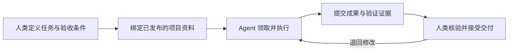

# ACCP


**让团队与 AI Coding Agent 围绕同一个任务，交付可验收、可追溯的成果。**

ACCP（Agent Collaboration Control Plane）是面向研发团队的 AI 协作管理平台。团队在浏览器中管理任务、共享项目资料、审核成果与审批工具操作；Agent 通过 Bridge 接入，领取任务、获取上下文并提交成果。每项任务由人类负责人最终验收。

[快速开始](#快速开始) · [使用指南](docs/web-console-guide.md) · [私有部署](docs/production-deployment.md) · [接入 Agent](docs/m2-execution.md#使用-local-bridge-和-go-sdk) · [参与贡献](CONTRIBUTING.md)

## 为什么使用 ACCP

当一个团队同时使用多个 AI Coding Agent 时，需求容易散落在对话中，执行依据难以对齐，代码产出也需要有人确认是否满足交付要求。ACCP 将这些工作组织为一条共同的协作流程：

- **知道谁负责什么**：每项任务都有明确的人类负责人、执行代理、依赖和验收条件。
- **使用确定的项目资料**：需求、接口和规范按版本发布，每次执行绑定固定的上下文快照。
- **围绕成果完成交付**：提交代码引用、文档或报告，核对来源与内容，再由负责人接受或退回。
- **让授权与操作可追溯**：限定 Agent 的项目权限和会话有效期，对网关中的高风险操作进行独立人工审批。

适合希望保留现有 AI 客户端、统一管理任务交付，并在企业内部部署协作平台的研发团队。

## 你可以用它做什么

| 能力 | 使用方式 |
| --- | --- |
| 任务与待办 | 创建任务、指定负责人和验收条件，按状态、负责人及关键字筛选；从工作台查看待验收任务、执行异常和待审批数量 |
| 项目资料 | 发布需求、接口与规范版本，让 Agent 按本次执行的快照读取资料，并引用前置任务的成果 |
| Agent 协作 | 通过通用 Bridge、MCP 或 Go SDK 接入执行客户端，领取任务、报告进展、提交成果，并按依赖衔接工作 |
| 成果验收 | 查看成果正文、Git 引用和来源链，核验 GitHub Commit / PR，逐项确认验收条件并接受或退回 |
| 工具审批 | 为受控工具配置权限与策略，由独立审核人批准高风险操作，查询执行结果与审计记录 |
| 团队管理 | 创建和归档项目、登记成员与仓库、分配项目角色、停用成员并撤销其 Agent 会话 |
| 运行维护 | 查看系统运行状态、事件失败和未知工具结果，导出脱敏诊断；使用配套工具维护、备份和恢复 |

Web 控制台支持简体中文、English 和 Русский，提供可分享的任务链接和移动端布局。

## 一次协作如何完成


```mermaid
flowchart LR
    A[人类定义任务与验收条件] --> B[绑定已发布的项目资料]
    B --> C[Agent 领取并执行]
    C --> D[提交成果与验证证据]
    D --> E[人类核验并接受交付]
    E -->|退回修改| C
```

例如交付一个订单查询 API：团队先发布接口约定，为实现和测试分别创建任务，并设置依赖。执行 Agent 读取对应快照，提交代码或测试报告；负责人根据已核验成果确认验收条件。需要通过网关执行高风险工具操作时，由另一位审核人审批。任务、执行、资料版本、成果和审核记录共同保留为交付依据。

详细操作见 [Web 使用指南](docs/web-console-guide.md)；完整场景见 [订单查询 API 协作示例](docs/collaboration-flow.md)。

## 快速开始

以下步骤用于在本机首次创建一个试用环境。需要 Git、Docker、Docker Compose v2 和 Node.js 22.22.3；Web 控制台与后端由 Docker 一起构建。

```sh
git clone https://github.com/JavaWeh/ACCP.git
cd ACCP
node scripts/dev-env.mjs
docker compose --env-file .accp-local/compose.env up --build -d
docker compose --env-file .accp-local/compose.env --profile tools run --rm bootstrap
```

启动后：

1. 打开 [本地开发登录页](http://127.0.0.1:8080/dev-login)。从本机 `.accp-local/dev-users.json` 读取生成的账号凭证登录；Alice 为演示项目管理员，Bob 为成员兼审核人。
2. 进入演示项目，在“项目资料”中创建并发布需求或规范，在“任务协作”中创建任务并填写验收条件。
3. 按 [Agent 接入说明](docs/m2-execution.md#使用-local-bridge-和-go-sdk) 登记客户端、创建受限会话并连接 Bridge，开始执行任务。

也可在仓库根目录运行以下命令生成一条待人工验收的示例任务，体验成果与验收流程：

```sh
node scripts/m2-smoke.mjs
```

该命令使用协议驱动生成示例成果，不会启动真实 AI 客户端。完成后以 Bob 登录，在“任务协作 → 成果与验收”中查看并验收。

本地数据保存在 Docker 命名卷中，随机凭证仅写入本机忽略目录。已有环境请按 [升级说明](docs/m3-m4-platform.md#运行与升级) 操作，保留原项目名和数据卷，不要重复初始化。

## 私有部署与接入

ACCP 提供单企业、单机 Linux Docker Compose 部署方案，使用企业 OIDC 账号登录。部署包含 Web 控制台、Go API、Worker、PostgreSQL 和 NATS；管理员需配置 HTTPS、身份服务、成员及仓库。

- [部署与持续管理](docs/production-deployment.md)：安装、身份接入、运行账号分权与安装自检。
- [运维、备份与恢复](docs/operations.md)：维护窗口、密钥轮换、加密备份、隔离恢复和故障处理。
- [Agent Bridge 与 SDK](docs/m2-execution.md#使用-local-bridge-和-go-sdk)：客户端连接、任务执行和会话配置。
- [工具网关配置](docs/m3-m4-platform.md#工具配置与-mcp-gateway)：接入 GitHub 或自有 MCP 工具，设置审批与结果核对。

审批和完整审计覆盖经 ACCP 网关授权执行的操作。客户端以独立凭证直接访问外部系统的行为不在该范围内。

## 当前可用范围

当前代码已提供任务、资料、执行、成果、审批与审计的协作闭环，以及团队管理和运维工具，可用于受控试用。Claude Desktop 与 Codex 已完成单人双客户端样例验收；已验证版本与限制见 [验收记录](docs/acceptance-2026-09-16.md)。

正式版本分发、目标规模容量验证和完整恢复验收仍有待完成。当前内容以文本与 Git 引用为主，正文上限为 256 KiB。评估部署时请结合 [交付计划与验证边界](docs/product-delivery-plan.md) 和 [运维验收记录](docs/acceptance-product-operations.md)，确认目标环境的适用范围。

## 文档与支持

| 我想要…… | 阅读入口 |
| --- | --- |
| 使用控制台、处理任务与常见错误 | [Web 使用与支持指南](docs/web-console-guide.md) |
| 理解权限、人工责任和审批规则 | [治理设计](docs/governance.md) |
| 了解架构、数据模型和协作协议 | [架构](docs/architecture.md) · [数据模型](docs/data-model.md) · [协议契约](contracts/README.md) |
| 查看交付进展和后续计划 | [产品交付计划](docs/product-delivery-plan.md) |
| 报告问题、提出建议或贡献代码 | [贡献指南](CONTRIBUTING.md) · [GitHub Issues](https://github.com/JavaWeh/ACCP/issues) |

## 参与贡献

欢迎通过问题反馈、功能建议、文档改进和代码贡献参与 ACCP。

- **报告问题**：通过 [缺陷报告](https://github.com/JavaWeh/ACCP/issues/new?template=bug_report.yml) 提供环境、复现步骤和预期行为。
- **提出建议**：通过 [功能建议](https://github.com/JavaWeh/ACCP/issues/new?template=feature_request.yml) 说明使用场景、遇到的问题和期望的改进。
- **贡献文档或代码**：先查看已有 Issue 和 PR，再阅读 [贡献指南](CONTRIBUTING.md)，准备开发环境、完成相关验证并提交 PR。

每项贡献由人类负责人确认范围与验收结果，欢迎使用 AI Agent 辅助完成。公开提交的日志、配置和截图请先脱敏。

## 许可证

ACCP 使用 [Apache License 2.0](LICENSE)。
