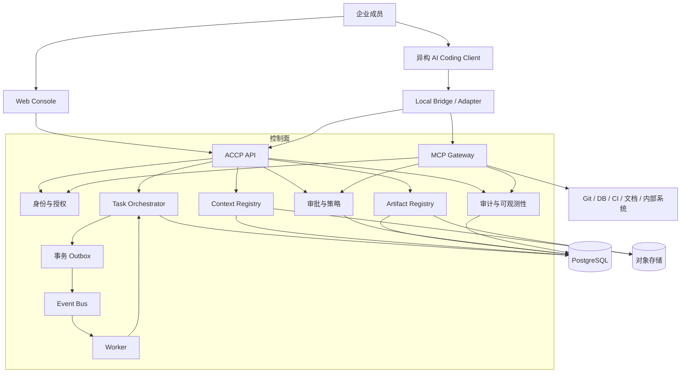

# 总体架构

> 当前实现包含 M1–M3 控制面与 M4 Web 功能。运行、升级与验收见 [M3/M4 平台](m3-m4-platform.md)；边界与代价见 [ADR 0006](adr/0006-controlled-delivery-console.md)。真实客户端联合验收暂缓。

## 定位与边界

ACCP 是企业研发协作控制面：保存责任、任务、共享上下文、成果与授权事实，连接人类成员和不同 AI Coding Client。它不承接模型推理服务，也不将聊天历史作为编排数据库。

当前已交付 Go 后端、PostgreSQL、JetStream Worker、MCP Gateway、通用 Bridge 和 TypeScript/React 控制台；优先单企业私有部署、多项目协作，所有资源保留企业隔离标识。正文暂存和项目锁设计延续 [ADR 0004](adr/0004-m1-foundation.md)，受控执行边界见 [ADR 0006](adr/0006-controlled-delivery-console.md)。

## 架构图

## 核心模块

| 模块 | 拥有的数据与责任 | 明确边界 |
| --- | --- | --- |
| Workspace & Identity | 企业、项目、成员、角色、Agent、Session、委托 | 不把 Agent 当成人类用户 |
| Task Orchestrator | Task、DAG、Assignment、Run、租约、重试、取消 | 不调用厂商私有 API |
| Context Registry | 权威来源、候选/发布版本、权限、快照 | 不在执行中替换历史版本 |
| Adapter Registry | 能力声明、协议协商、兼容性信息 | 客户端扩展留在有命名空间的元数据中 |
| Event Service | 事务投递、订阅授权、去重、重放 | 事件总线不是权威状态存储 |
| Artifact Registry | 成果、关系、摘要、验证与验收状态 | 外部 Git 状态以 Git 服务为准 |
| Governance | 风险策略、操作审批、成果验收 | 人工决定不能由 Agent 身份签发 |
| MCP Gateway | 工具目录、授权检查、凭证隔离、调用记录 | 不保证绕过网关的本地操作受控 |
| Audit & Observability | 责任链、审计记录、指标与 trace | 审计证据与普通日志分开管理 |

Go 模块通过明确的领域服务接口交互，Adapter 和 Git Provider 在基础设施边界实现。API、Worker、Gateway 初期共享代码库，可独立部署进程；模块不直接写其他模块拥有的状态。

## 存储与部署

- PostgreSQL 保存业务状态、授权、审批、审计索引和 Outbox/Inbox。业务状态变更与事件写入使用同一事务。
- NATS JetStream 负责持久投递，消费者按至少一次交付设计。Agent 不直接连接内部消息总线。
- S3 兼容存储保存 Context 内容与大成果；数据库保留对象引用、内容摘要与访问控制。
- 企业人类身份通过 OIDC 接入；Adapter 使用 ACCP 签发的短期 Session 授权，不能共享人类登录令牌。
- OpenTelemetry 关联 HTTP、事件消费与工具调用。生产密钥由企业 Secret Manager 注入，不写入协议示例。

MVP 目标部署为 Linux 上的容器服务；开发者客户端可运行于 Windows、macOS 或 Linux。仓库提供 Compose 启动与升级方案，API 同源提供 Web 静态资源；Kubernetes 不在当前范围。

## Source of Truth

| 资源 | 权威来源 | ACCP 保存内容 |
| --- | --- | --- |
| Task、授权、审批、验收 | ACCP | 状态、版本和审计证据 |
| Commit、PR、合并状态 | Git 服务 | 不可变 SHA、链接、核验结果与核验时间 |
| Requirement、API、DB Schema、ADR、规范 | 每个 Context 明确声明的唯一来源 | 来源版本、内容快照、摘要、发布记录 |
| Agent Memory、Conversation | 非权威辅助资料 | 可选引用，不得自动覆盖上述资源 |

Context 外部来源更新创建新候选版本。人类发布后通知受影响任务；已领取 Run 仍绑定原始快照。更改权威来源需要记录原因与审核，历史来源不回写。

## 扩展路线

增加客户端只增加 Adapter；增加 Git 服务只实现 Git Provider；新 MCP 工具注册后仍受统一策略约束。公共事件与 API 不包含 Claude、Codex、Cursor 等产品专属必填字段。

仅当负载、故障隔离或企业部署需求明确时拆分模块为服务。多租户 SaaS、集中 Runner 与跨区域高可用见 [MVP](mvp.md)，关键取舍见 [ADR](adr/README.md)。
