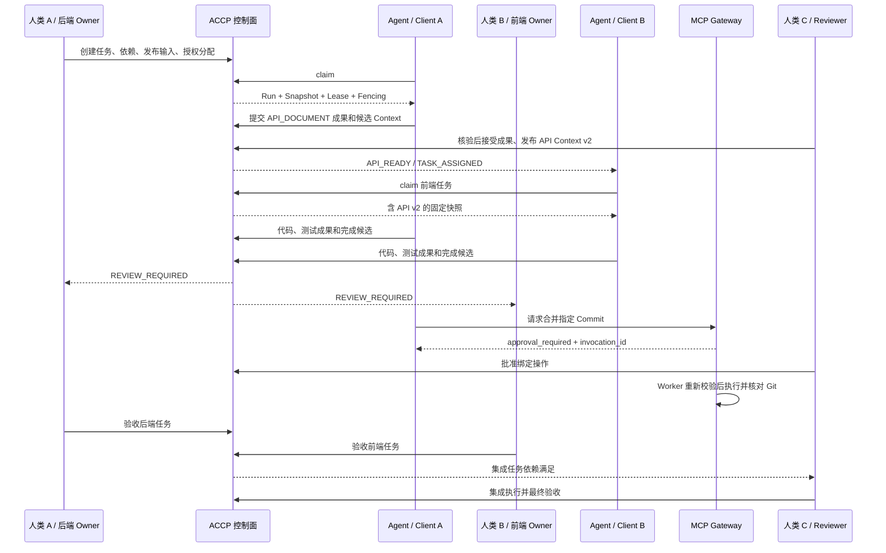

# 完整协作流程：订单查询 API

本示例描述未来 MVP 的验收流程，不是当前已运行结果。成员 A、B、C 为人类；Client A 和 Client B 表示不同厂商客户端，名称不参与领域逻辑。

## 准备与任务图

成员 A 负责后端任务 `task_backend`，成员 B 负责前端任务 `task_frontend`，成员 C 负责集成任务 `task_integration`。每个任务包含人类 Owner 和具体验收条件，使用独立工作分支或工作区。

人类发布 Requirement v1、API 规范 v1、DB Schema v1 和项目规范 v1。后端绑定这些输入；前端依赖后端的 API_DOCUMENT 成果被接受；集成依赖前后端任务 DONE。

## 步骤与证据

1. **创建与授权**：Task 创建为 DRAFT；Owner 分配能力队列或 Agent，submit 后检查输入与依赖。Assignment 记录由谁授权，事件仅由控制面发布。
2. **后端领取**：Agent 通过人类委托的 Session claim；控制面原子创建 Run、快照及租约，记录起始代码 revision。执行中保持心跳。
3. **API 先行**：后端提交 API 文档和候选 Context。服务端核对摘要，Reviewer 人类接受成果并发布 API v2。控制面生成 API_READY，依赖记录锁定 Artifact ID 与版本。
4. **前端接入**：前端使用另一种真实客户端，通过相同契约领取任务。快照包含 API v2；不会因为后端再发布 v3 而被隐式替换。
5. **提交代码与测试**：两边分别登记不可变 Commit、PR、Diff、测试报告。服务端补全 Run 和身份来源并核验外部版本，生成 CODE_READY。
6. **请求审核**：Agent 完成候选包含成果集合和验收项报告。验证后 Task 进入 IN_REVIEW，发出 REVIEW_REQUIRED；Agent 自报 100% 不能进入 DONE。
7. **受控合并**：Gateway 根据指定 Commit、目标分支、参数摘要与策略生成审批。Reviewer C 与请求者的人类委托人分离；批准后 Worker 重新校验，执行一次并读取 Git 结果。
8. **人类验收**：Owner A/B 验收精确成果版本后任务 DONE，集成任务被释放。成员 C 的 Agent 可执行集成验证，但最终仍由人类 C 验收。

## 异常分支

| 情况 | 预期行为 |
| --- | --- |
| API v3 在前端执行中发布 | 通知 Owner，Run 保持 v2；若决定升级，停止旧 Run 后新建尝试 |
| Client A 断线超过租约 | Run LOST，Task BLOCKED；旧 token 拒绝写入，人类决定重试 |
| API_READY 重复或先于本地缓存更新到达 | 去重后查询权威依赖事实，不重复领取或改写快照 |
| 审批后 Commit 变动 | 原审批不适用，阻止执行并创建新的审批意图 |
| 合并请求超时但 Git 可能已执行 | ToolInvocation UNKNOWN，先查询 Git 再决定后续动作 |
| Owner 拒绝成果 | 保留审核及失败证据，Task 返回 READY/BLOCKED，新 Run 修订 |
| Session 被撤销 | 拒绝新调用，停止待执行意图，核对已开始的外部操作 |

## 追溯验收

选择任一最终 Artifact，应能查询：人类 Owner → 人类委托人 → AgentIdentity/客户端版本 → Session → TaskRun → ContextSnapshot 和代码基线 → ToolInvocation/Approval → Artifact 摘要与外部 revision → 人类验收记录。

当前对应示例在 [contracts/examples](../contracts/README.md)，示例数据均为虚构标识与保留域名。
