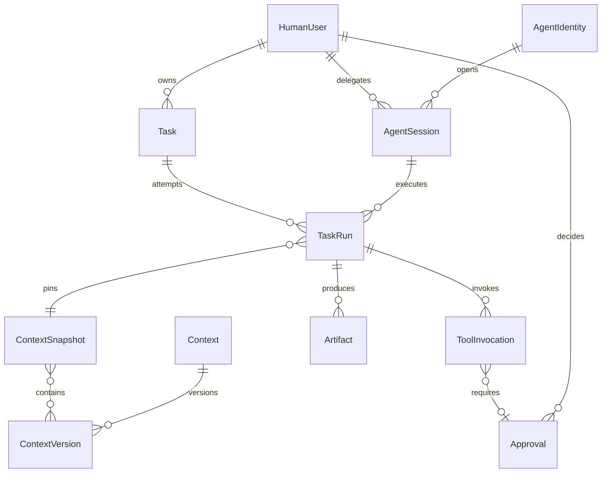
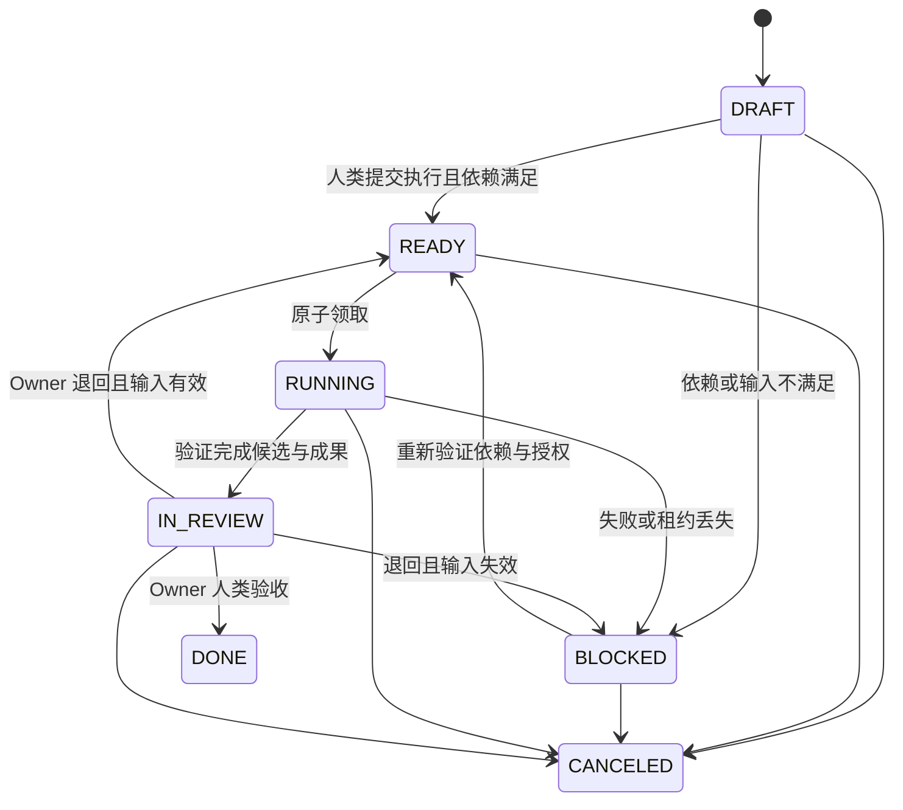

# 核心数据模型

本文件定义领域约束；机器可读结构见 [Domain Schema](../contracts/schemas/domain.schema.json)。Schema 不能判断一个 ID 是否属于真实人类，也不能验证跨表权限，这些是未来服务端的强制约束。

## 标识与隔离

- 公共 ID 为不透明字符串；客户端不从 ID 推断权限或类型。示例使用可读 ID，不代表生产 ID 编码规则。
- 业务资源携带 `organization_id`，项目资源同时携带 `project_id`；关联使用同企业/项目约束与外键验证。
- OIDC 主体按 issuer 与 subject 组合映射，不能用可修改的邮箱作为身份主键。
- 可修改实体使用递增 `version`，时间使用 UTC RFC 3339；历史版本及执行记录不可覆盖。

## 实体与关系

| 实体 | 关键字段/关系 | 约束 |
| --- | --- | --- |
| HumanUser / Membership | issuer、subject、project、role、active | 人类与 Agent 分表；Owner 必须为有效项目成员 |
| AgentIdentity | adapter_id、client_name、client_version、registered_by | 客户端名字是元数据，不影响业务分支 |
| AgentSession | agent_id、delegated_by_user_id、scopes、expires_at、revoked_at | 绑定人类委托，可提前撤销 |
| Task | owner_user_id、目标、验收条件、status、version | 无 Owner 不得创建，Agent 不得充当 Owner |
| Assignment | task_id、agent_id 或 capability_queue、assigned_by | 目标二选一，人类授权；不自动创建人类身份 |
| TaskDependency | predecessor_task_id、successor_task_id、condition | 只允许同项目 DAG，不允许自依赖 |
| TaskRun | task_id、session_id、attempt、snapshot、lease、fencing_token | 一个 Task 同时最多一个活跃 Run |
| Context | type、source、ACL、current_published_version_id | 一个 Context 只有一个当前权威来源 |
| ContextVersion | context_id、source_revision、digest、status、published_by | 内容不可变；发布状态有单独审计 |
| ContextSnapshot | entries、digest | 绑定精确版本 ID 和内容摘要，不使用 latest |
| Artifact | run_id、类型、URI、immutable_revision、digest、provenance | 核验结果与人工验收分离 |
| ArtifactRelation | source_artifact_id、target_artifact_id、relation | 支持 derived_from、implements、tests、supersedes |
| Approval | requester、binding_digest、policy_version、expires_at、decision | 必须人类签发决定，操作变更后失效 |
| ToolInvocation | session、run、tool、resource、binding、external_operation_id | 保存执行意图、结果及不确定状态 |
| Event / Outbox / Inbox | event_id、aggregate_version、consumer_id | Outbox 同事务；Inbox 按消费方和事件 ID 唯一 |
| AuditRecord | actor、accountable_user_id、owner_user_id、refs、result | 人类责任链保留发生时的身份值 |

## Task 与 Run 状态机

`READY` 表示可领取，Assignment 是执行目标而非新增状态。创建 Task 默认为 `DRAFT`，通过人类 submit 命令进入 READY/BLOCKED。失败不会无限自动重试：MVP 由人类明确 retry，创建新的 Run；历史 Run 保留失败原因。

Run 状态：`RUNNING`、`SUCCEEDED`、`FAILED`、`CANCELED`、`LOST`。`SUCCEEDED` 表示 Agent 执行结束且成果齐备，Task 仍需验收。Run 在领取事务创建，因此不另设无租约的“已领取”状态。

取消 Task 阻止新领取与网关副作用，向客户端发出停止请求；外部命令可能已开始，不能把取消解释为回滚。Task DONE/CANCELED 不原地重开，需要新任务并建立关联。

## 依赖、进度与版本

- `TASK_DONE` 条件等待指定前置任务完成人类验收。
- `ARTIFACT_ACCEPTED` 条件锁定前置任务的指定成果类型；首次满足时原子记录接受的 Artifact ID 与摘要，不能自动换成后续版本。
- API_READY 在 API 成果核验、人类接受且对应 API Context 发布后生成；它是通知，依赖释放仍以数据库事实为准。
- 修改 DAG 在项目级事务锁内检查循环；RUNNING/IN_REVIEW/终态 Task 不允许改依赖。
- 显示状态、验收项与 Agent 自报百分比。百分比达 100 不会完成 Task。
- 重试、Owner 变更和 Context 调整采用人类命令并审计；活跃 Run 的 Owner 不原地修改，须先停止并处理在途操作。

## 快照与来源证据

快照只包含已发布且当前授权可读的 ContextVersion；按 Context ID 排序，规范化 JSON 后计算 SHA-256。Run 固定快照 ID、输入摘要和起始代码 revision。权限撤销仍生效，不能因为快照存在而继续分发内容。

Artifact 保存 `task_id`、`task_run_id`、`session_id`、`agent_id`、`owner_user_id`、`delegated_by_user_id`、`context_snapshot_id` 及内容摘要。服务端从 Run 补全这些字段，客户端不能伪造责任链。Git 成果保存不可变 revision；人工接受前由服务端核验。非 Git 上传成果由服务端重算内容摘要。

核验状态为 `UNVERIFIED / VERIFIED / FAILED`，验收状态为 `PENDING / ACCEPTED / REJECTED`。摘要证明内容一致，不能独自证明作者身份或业务正确性。
