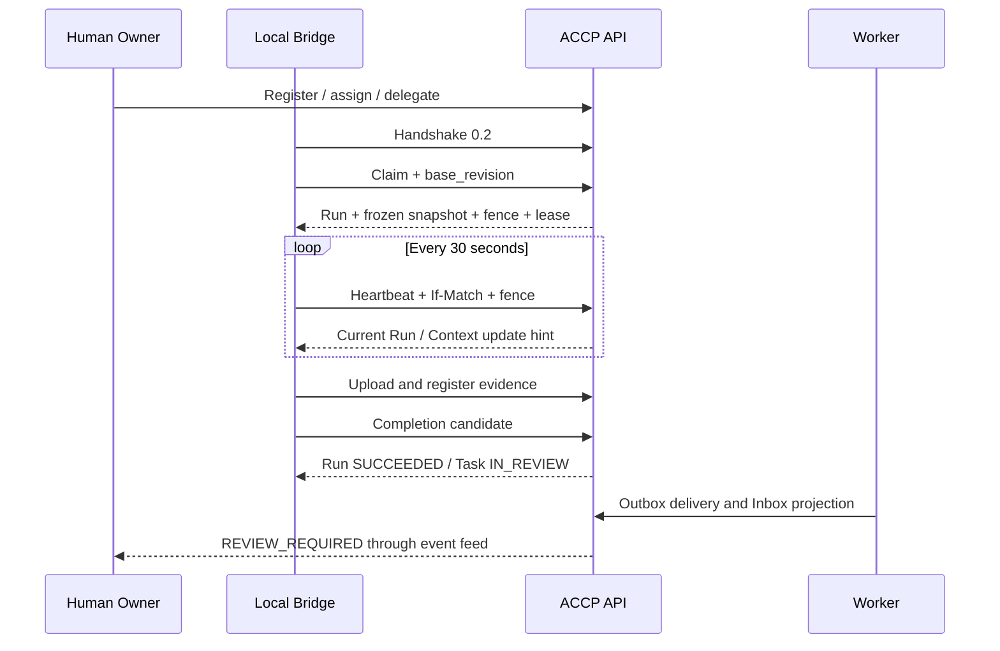

# M2 异构执行与事件协作

M2 在 M1 人类控制面上增加可运行的 Agent 执行协议。当前交付 API、Worker、Go SDK 和 Local Bridge；Web 界面按路线留在产品闭环阶段。

## 已实现与边界

| 能力 | M2 行为 |
| --- | --- |
| Agent / Session | 人类注册客户端 manifest，委托有限范围的 Session；协商 ACCP 0.2，随时撤销 |
| Task 编排 | 指定 Agent 或 `general` 能力队列；依赖 DAG；原子领取、取消、人工重试 |
| TaskRun | 单 Task 单活跃 Run；递增 fencing token；90 秒租约、30 秒心跳 |
| ContextSnapshot | 领取时保存不可变版本集合和摘要；发布更新不会替换执行输入 |
| 成果证据 | 保存最多 256 KiB UTF-8 正文；核对摘要，服务端补全来源；外部引用为 UNVERIFIED |
| 执行报告 | PROGRESS、FAILURE、COMPLETION_CANDIDATE；支持查询报告；完成候选进入 IN_REVIEW |
| 事件 | PostgreSQL Outbox → JetStream → Inbox / Feed；轮询、SSE、人工重放 |
| Adapter | Go HTTP SDK、MCP stdio Bridge、CLI 工具调用模式；无需厂商 SDK |
| 审计 | 成功写入关联人类委托、实际 Agent Session、Owner、Run、快照和成果 |

Git Provider 核验、成果人工接受、Task 最终 DONE、MCP Gateway、高风险操作审批属于 M3。M2 的 `VERIFIED` 仅证明服务端持有匹配摘要的正文，不证明测试实际运行或代码正确。Agent 无法伪造可信领域事件，也不能调用人类审批、发布和 Task 命令接口。

`TASK_DONE` 和 `ARTIFACT_ACCEPTED` 依赖只读取数据库中的真实完成/接受事实。M2 没有生成这些事实的验收 API，因此不能完成包含最终人工接受的端到端流程；不会把 Run SUCCEEDED 当作 Task DONE 来提前解除依赖。

## 本地部署与从 M1 升级

需要 Go 1.27.1（源码构建）、Docker Compose v2 和 Node.js 22。初次使用：

```sh
node scripts/dev-env.mjs
docker compose --env-file .accp-local/compose.env up --build -d
docker compose --env-file .accp-local/compose.env --profile tools run --rm bootstrap
node scripts/m2-smoke.mjs
```

已有 M1 数据时，先备份 PostgreSQL 卷与本地配置，再执行：

```sh
docker compose --env-file .accp-local/compose.env stop api worker
node scripts/dev-env.mjs --upgrade-m2
docker compose --env-file .accp-local/compose.env up --build -d
node scripts/m2-smoke.mjs http://127.0.0.1:8080
```

升级后不要再次 bootstrap：原成员和凭证仍保留。开发凭证超过七天时按 M1 身份文档重新配置；不得把生产认证改成开发模式。升级脚本仅补缺失配置，不覆盖数据库密码、已有 Session 签名密钥或 NATS 凭证。

Compose 保留原项目名 `accp-m1` 以复用已有 `postgres-data` 卷；它只是存储兼容名称。不要执行 `down -v`。迁移 002 改变幂等记录主键，必须协调停止旧 API 后升级，不能让 M1/M2 二进制混用数据库。迁移成功后回退 M1 需要恢复升级前数据库备份。

若 8080 不可用，在私有 `.accp-local/compose.env` 中同时设置 `ACCP_HTTP_PORT=18080` 和 `ACCP_PUBLIC_URL=http://127.0.0.1:18080`。启动后访问 `/readyz`；该接口只证明 API 和数据库就绪。Worker、NATS 及完整流程通过 smoke 检查和日志验收：

```sh
docker compose --env-file .accp-local/compose.env ps
docker compose --env-file .accp-local/compose.env logs --tail 50 worker
node scripts/m2-smoke.mjs http://127.0.0.1:18080
```

smoke 工具读取私有开发凭证，创建真实 Task/Context/Session，完成领取、续租、证据登记和待审报告，等待 `REVIEW_REQUIRED`，再撤销临时 Session 并检查访问被拒绝。输出只含资源 ID 和状态；每次运行产生独立验收数据。它是协议驱动器，不是两个真实 AI 客户端的兼容性证明。

生产通过操作者配置 `DATABASE_URL`、OIDC、`ACCP_PUBLIC_URL`、随机 `ACCP_SESSION_KEY`、`ACCP_NATS_URL` 和 `ACCP_NATS_TOKEN`。API 与 Worker 使用同一持久签名密钥；不要每次启动重新生成。轮换时撤销旧 Session 并重新委托；事件游标也会失效。密钥和数据库分别受控备份。远程 API 使用 HTTPS；Compose 的数据库和 NATS 不发布宿主机端口。

## 人类与 Agent API

完整字段见 [OpenAPI](../contracts/openapi.yaml)。以下路径均在 `/api/v1` 下：

| 人类操作 | 约束 |
| --- | --- |
| `POST /agents` | MEMBER/ADMIN 注册 `project_id` 和 manifest |
| `POST /agent-sessions` | 委托当前人类权限的子集，有效期 30 秒至 24 小时 |
| `GET /agent-sessions/{id}` | 当前项目成员读取状态和版本，不返回 token |
| `POST /agent-sessions/{id}/revoke` | 委托人或 ADMIN，If-Match 为 Session 版本 |
| `POST /tasks/{id}/assignments` | Owner/ADMIN，If-Match 为 Task 版本；替换活跃分配，保留历史 |
| `POST /tasks/{id}/dependencies` | Owner/ADMIN；同项目且无环；运行开始前可修改 |
| `POST /tasks/{id}/dependencies/{dependency}/remove` | Owner/ADMIN，记录原因与当前 Task 版本 |
| `POST /tasks/{id}/commands` | SUBMIT / RETRY / CANCEL；失败和失联后必须人工 RETRY |
| `POST /projects/{id}/events/{event}/replay` | ADMIN；记录原因，重投同一事件 ID |

Agent 的范围使用以下固定名称：

| Scope | 操作 |
| --- | --- |
| `tasks:read` | 读取项目 Task、本人 Session 的 Run 和成果 |
| `runs:claim` | 领取已分配且 READY 的任务，必须先 handshake |
| `runs:write` | 本 Session Run 的心跳和报告 |
| `context:read` | 项目 Context 正文/版本，以及本人 Run 的快照 |
| `artifacts:write` | 本 Run 的成果正文上传与登记 |
| `events:read` | 当前项目通知订阅 |

每次请求都重新读取 Session、有效期、人类账号和项目成员权限；Session 权限不会因旧幂等响应而恢复。Agent 不能通过传入 `owner_user_id` 或人类身份字段扩大授权。M2 的内容权限沿用 M1 项目边界；Session 不能跨项目使用。

人类成员或 Run 所属 Session 可通过 `GET /task-runs/{id}/reports` 查询进度、错误与完成候选说明；按 `created_at` 排序查看时间线。Failure 的 `error_code` 限制为 128 字节，详细输出放入报告正文或成果。

所有 POST 需要 8–128 字符的 `Idempotency-Key`。Heartbeat、Report、Artifact 上传/登记还要求当前 Run 的 `If-Match` 和 `X-Run-Fencing-Token`；分配与依赖操作使用 Task 的版本。历史分配的响应 ETag 不是当前 Task ETag，后续 Task 操作前重新 GET。

幂等记录按项目、实际人类或 Session、路由、key 隔离。重试保留原 body、If-Match 和 fence。Session token 只在授权响应中重建，不存入幂等记录或审计。服务端先校验当前授权，再读缓存；旧 claim 或 heartbeat 不能重新激活已结束/过期的 Run。完全相同的终态 Report 重试可返回原回执，但不续租或重复产生事件。

## 执行输入、租约与恢复



`base_revision` 必须是 40 或 64 位小写十六进制不可变代码版本。M2 记录客户端声明；Git Provider 核验将在 M3 提供。快照摘要基于按 Context ID 排序的条目 JSON，条目只含 Context ID、版本 ID 和内容摘要；不从 Agent 记忆推断输入。

心跳以服务端时间续租，客户端 `observed_at` 仅为观察时间。Context 更新提示不修改快照。新 Run 使用 Task 显式绑定的已发布版本；人类需要新输入时应取消并创建绑定新版本的任务，M2 尚无编辑 Task 输入的 API。

失联、会话撤销/过期、委托人失去执行权限或 Owner 停用后，后续受控写入立即被拒绝；Worker 最迟下一次轮询将活跃 Run 记为 LOST，并将 Task 放回 BLOCKED。Worker 每五秒扫描；发生数据库故障时恢复时间取决于数据库可用性。它不会自动重试模型执行。人类 RETRY 后的新领取创建新 Run、attempt 和 fence，保留旧 Run。

取消是协作取消：Task 命令立即关闭 Run，下一次读取/心跳告知客户端停止。Bridge 不拥有 AI 客户端进程，不能强制结束本地 shell，也不宣称能阻止独立凭证绕行操作。

## 使用 Local Bridge 和 Go SDK

```sh
go build -o bin/accp ./cmd/accp
go build -o bin/accp-bridge ./cmd/accp-bridge
```

人类先用已认证 API 注册 manifest、分配任务并创建 Session。将 Session token 和 manifest 文件配置到客户端 MCP 子进程的私有环境中：

| 环境变量 | 值 |
| --- | --- |
| `ACCP_URL` | API origin，例如 `http://127.0.0.1:8080` |
| `ACCP_SESSION_TOKEN` | 人类创建 Session 后获得的短期 token |
| `ACCP_ADAPTER_MANIFEST` | 已注册 manifest 的本地绝对路径 |

启动命令为 `accp-bridge stdio`。它先通过 `/adapters/handshake` 协商，再仅通过 stdin/stdout 承载 MCP；错误写 stderr。MCP 版本固定为 `2025-11-25`。manifest 使用 [0.2 示例](../contracts/examples/valid/m2-manifest.json)，其中 client name/version 填实际客户端；修改后由人类重新注册。服务端核对 manifest 与注册记录一致。

十个 MCP 工具：`accp_task`、`accp_run`、`accp_claim`、`accp_heartbeat`、`accp_report`、`accp_snapshot`、`accp_context_content`、`accp_artifact_upload`、`accp_artifact_register`、`accp_events`。

工具输入通过 `id` 指定资源；写入使用 `body`、`idempotency_key`、`version` 和 `fencing_token`。例如：

```json
{
  "idempotency_key": "one-stable-operation-key",
  "body": {
    "project_id": "project_demo",
    "task_id": "task_example",
    "base_revision": "aaaaaaaaaaaaaaaaaaaaaaaaaaaaaaaaaaaaaaaa"
  }
}
```

该输入用于 `accp_claim`；其中 Task ID 和 base_revision 必须替换成真实值。CLI 模式复用同一工具定义：`accp-bridge call accp_claim < input.json`。CLI 每次启动都会协商，不自动重试写入。

M2 Bridge 提供显式心跳工具，调用客户端负责每 30 秒续租、读取返回的新 Run version，并在取消/租约拒绝时停止。Bridge 不自动续租无响应的客户端。`auto_start=false`、`cancel=cooperative`；不能自动启动的客户端由人类启动。`accp_events` 使用轮询，其他 Adapter 可直接使用 SSE。Go 集成可导入 [pkg/client](../pkg/client/client.go)，其 SDK 拒绝非 Session token、跨站重定向和远程明文 origin。

这些工具只访问 ACCP 协作 API。M3 的 `/mcp` Gateway 尚未提供，因此 0.2 handshake 不返回 `mcp_uri`，也没有 Git/数据库/部署工具权限。

## 事件投递与排错

业务变更与 Outbox 在同一 PostgreSQL 事务提交。Publisher 获得 JetStream ACK 后才标记已投递；无法确定结果时重用 message ID 并退避。Consumer 核对 JSON Schema 和原始 Outbox，提交 Inbox / Feed 后才 ACK。Feed 按已处理顺序提供游标；重投与重试可能使通知相对业务版本乱序，消费方依据 `aggregate_version` 和 GET 读取的权威状态决策。

NATS 使用持久存储，保留七天，流大小上限 256 MiB；达到上限后 Publisher 保留未确认意图并等待恢复。Consumer 连续失败五次后先保存 `event_failures` 再停止该消息；数据库不可用时不会先丢弃消息。人工 replay 重投相同 CloudEvent ID，已处理事件被 Inbox 去重。重放只修复投递，不重新运行 Agent 或重做外部操作。

`GET /events?project_id=...` 返回 `items` 和 `next_cursor`，即使当前无事件也返回游标。SSE 每个 `accp.events` 消息承载完整页，`id` 是该页的 next_cursor；仅在处理完整页后保存游标。连接最多 20 秒，客户端自行重连。游标签名绑定项目，有效期七天；失效或被篡改时重新查询 Task/Run 状态并建立订阅。

普通事件不包含 Context 正文、工具输出或 token。M2 的普通审计记录成功写入；拒绝请求返回 trace_id，完整拒绝审计、集中 OpenTelemetry 和持久运维告警仍需后续补齐。

## 开发验证与验收

集成测试要求真实 PostgreSQL 和启用 JetStream 的 NATS。配置 `ACCP_TEST_DATABASE_URL`、`ACCP_TEST_NATS_URL` 后：

```sh
npm ci --ignore-scripts
npm run check
go test ./...
go test -race -tags=integration -count=1 ./...
go vet ./...
```

测试为每个场景创建隔离 PostgreSQL schema 和独立 NATS stream，结束后清理。测试数据库用户需要建 schema 权限，绝不能配置生产数据库。Windows 的 race 检测需 C 编译器；CI 使用 Linux race 检测。

验收重点是：同一 Task 只能领取一次；旧 fence/版本被拒绝；Context 发布不改变旧快照；撤销后连缓存请求也失效；失败不能自动重试；证据来源可回溯；Agent 无法自动 DONE；重复投递不产生重复 Feed；真实 MCP stdio 子进程能完成协商、领取、续租。

真实厂商客户端兼容性仍待联合验收；标准 MCP SDK 测试客户端和 smoke 驱动器不能计作两种真实 AI 客户端。下一阶段 M3 补齐受控交付与人类接受，M4 再提供 Web 平台和完整联合验收。
